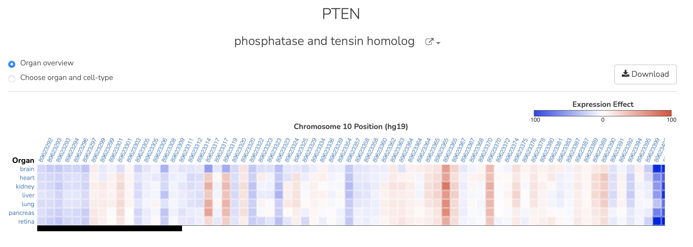

=======
ExPectoSC
=======

Introduction
------------
ExPectoSC is a framework for `ab initio` sequence-based prediction of mutation gene expression effects for primary human cell types. With this web interface, we provide an explorer of cell type-specific expression effect predictions. The current release contains all ClinVar variants within +/- 20kb of the representative TSS of a gene. We use 1000 Genomes variant effects predictions for z-score normalization. No effect threshold was employed for the current release of the data.

The code for predicting expression effects for human genome variants and training new expression models is available at this `github repository <https://github.com/ksenia007/ExPectoSC>`_.

The ExPectoSC framework is described in the following manuscript:

Ksenia Sokolova, Chandra L. Theesfeld, Aaron K. Wong, Zijun Zhang, Kara Dolinski and Olga G. Troyanskaya, Atlas of primary cell-type specific sequence models of gene expression and variant effects, Submitted, 2023

Website overview
------------
After user enters a gene name, the Primary View is returned showing the predictions for the pre-computed variants for the region (includes 1000G and ClinVar variants). The variants are oriented so that the lowest chromosomal coordinate for the gene region is on the left side of the screen. The heatmap colors represent the max effect cell type prediction within the organ system. Rows are grouped organ systems, and columns are variant locations

Download
--------
`ClinVar scaled non-coding predictions <https://humanbase.s3.us-west-2.amazonaws.com/clever/clinvar_1000G_final_nc_all_info.csv>`_ 

`sLDSC annotations <https://humanbase.s3.us-west-2.amazonaws.com/clever/CLEVER_preds_sLDSC_annot.tgz>`_ 

Method Details
--------------
ExPectoSC is a modular framework, that uses regularized linear module upon deep convolutional network model of chromatin profifiling effects to predict cell type specific expression. The framework is capable of predicting expression levels directly from sequence and is sensitive to the sequence variations.

The chromatin predictions were computed using a DeepSEA "Beluga" model, using sliding window approach of 2000bp width with 200bp step, for the 40kb region surrounding the TSS. Exponential condense function is then used to reduce the dimensionality of the data before using it in the module 2. To analyze effect of the variants we get predictions for the reference and alternative sequences and compare the difference. 

